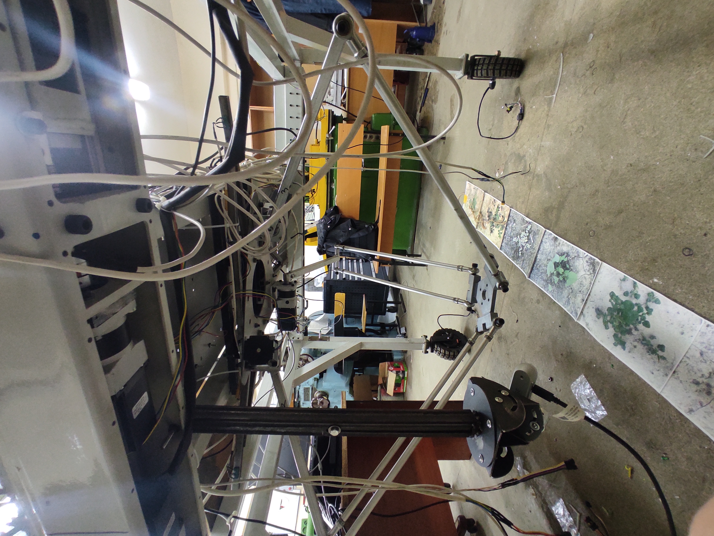

# DeltaRobotFirmware

Прошивка контроллера дельта-робота AgroRobot на базе STM32F407. Проект управляет шаговыми приводами робота, принимает траектории по RS-485/Modbus RTU, выполняет калибровку по концевым выключателям и поддерживает сервисные команды для диагностики и аварийной остановки.



[Демонстрация работы робота](VID_20260219_184436.mp4)

## Назначение

Прошивка предназначена для нижнего уровня управления дельта-роботом: формирует импульсы STEP/DIR для приводов, синхронно запускает движение трех основных осей, управляет четвертым каналом, контролирует концевики и предоставляет регистровый интерфейс для внешнего управляющего ПО.

Основные возможности:

- управление 3 основными осями дельта-механизма и отдельным 4 каналом;
- построение профиля движения из сегментов углов в arcmin;
- запуск траекторий с заданным общим временем выполнения;
- прием пакетов траектории по Modbus RTU;
- чтение статусов, ошибок, концевиков и счетчиков осей;
- калибровка по концевым выключателям с сохранением счетчиков во Flash;
- аварийная остановка и сброс активного движения;
- локальное управление кнопками KEY1-KEY5;
- звуковая индикация срабатывания концевиков.

## Аппаратная платформа

- MCU: `STM32F407IGTx` (`STM32F407IGT6`, LQFP176).
- Тактирование: SYSCLK 168 MHz от HSI + PLL.
- RTOS: FreeRTOS через CMSIS-RTOS v1.
- Драйверы: STM32 HAL, CMSIS.
- Основной таймер движения: `TIM8`, Output Compare, каналы CH1-CH4.
- Таймер измерения времени траектории: `TIM5`.
- Time base HAL: `TIM2`.
- Связь RS-485: `USART3`, направление прием/передача через `USARTx_CTRL`.
- Отладочный UART: используется общий вывод через `UART_SendString`.

## Структура проекта

- `TestChannels.ioc` - конфигурация STM32CubeMX.
- `Src/`, `Inc/` - основной пользовательский код и сгенерированные HAL-модули.
- `Src/bsp/motor.c`, `Inc/bsp/motor.h` - управление шаговыми двигателями, профили движения, калибровка, счетчики осей.
- `Src/bsp/rs485.c`, `Inc/bsp/rs485.h` - Modbus RTU по RS-485, регистры статуса и команды.
- `Src/freertos.c` - задачи FreeRTOS, обработка кнопок, концевиков и фоновых сервисов.
- `Drivers/` - STM32 HAL и CMSIS.
- `Middlewares/Third_Party/FreeRTOS/` - исходники FreeRTOS.
- `MDK-ARM/` - проект Keil uVision и артефакты сборки.
- `Makefile` - сборка, прошивка и очистка из командной строки.

## Задачи FreeRTOS

Прошивка создает несколько задач:

- `defaultTask` - основной цикл локального управления, обработка кнопок, включение/отключение приводов, запуск тестовых движений.
- `LimitSwitch` - опрос концевиков, остановка осей при движении в сторону концевика, обработка калибровки, звуковые сигналы.
- `ListenCommand` - прием и обработка Modbus RTU команд по RS-485.
- `Buzzer` - выполнение запросов на звуковую индикацию.

## Управление кнопками

- `KEY1` - включение системы и запуск калибровки.
- `KEY2` - запуск движения по сегментам `angle_segments`.
- `KEY3` - запуск движения в обратном направлении.
- `KEY4` - отключение драйверов и остановка `TIM8`.
- `KEY5` - вывод последних ошибок.

## RS-485 / Modbus RTU

Адрес устройства: `0x01`.

Поддерживаемые функции:

- `0x03` - чтение holding-регистров статуса.
- `0x10` - запись нескольких регистров для загрузки траекторий и команд.

Важные регистры чтения:

| Адрес | Значение |
| --- | --- |
| 4 | `ena`, состояние включения драйверов |
| 5 | `alarm`, аварийное состояние |
| 6 | `ready`, готовность к новой команде |
| 7 | `is_on`, состояние системы |
| 8 | флаги движения `MotionStatusFlags()` |
| 9 | режим RS |
| 11-20 | последние коды ошибок |
| 21-24 | состояния концевиков |
| 25-30 | 32-битные счетчики трех осей |
| 33-34 | версия протокола |
| 35-36 | версия прошивки |

Важные команды записи:

| Адрес | Регистры | Команда |
| --- | --- | --- |
| 300 | 2 | запуск траектории: количество сегментов и время, мс |
| 301 | 1 | возврат в home |
| 302 | 2 | запуск 4 канала на 180 градусов с заданным временем |
| 303 | 1 | аварийная остановка |
| 400+ | кратно 3 | загрузка сегментов траектории для трех осей |
| 406 | 1 | запуск калибровки |
| 407 | 1 | переход в рабочую верхнюю центральную позицию |

Сегменты траектории передаются с адреса `400`: на каждый сегмент идет 3 регистра для осей X/Y/Z. Значения интерпретируются как `int16_t` в угловых минутах.

## Сборка и прошивка

Проект можно открыть в Keil uVision через:

```text
MDK-ARM/TestChannels.uvprojx
```

Также доступен `Makefile`:

```bash
make build
make flash
make erase
make clean
```

По умолчанию `make` выполняет `clean` и `flash`. Пути к инструментам можно переопределить переменными:

```bash
make flash UV4="C:\Keil_v5\UV4\UV4.exe"
make flash STM32_PROG_CLI="C:\Program Files\STMicroelectronics\STM32Cube\STM32CubeProgrammer\bin\STM32_Programmer_CLI.exe"
```

## Медиа

- Фото робота: `IMG_20260404_200424.jpg`.
- Видео демонстрации: `VID_20260219_184436.mp4`.

## Контакты

Рекомендованный способ связи: Telegram `@yerlan_ayapov`.

Email:

- `E.Ayapov@stud.satbayev.university`
- `www.yerlan4@gmail.com`
